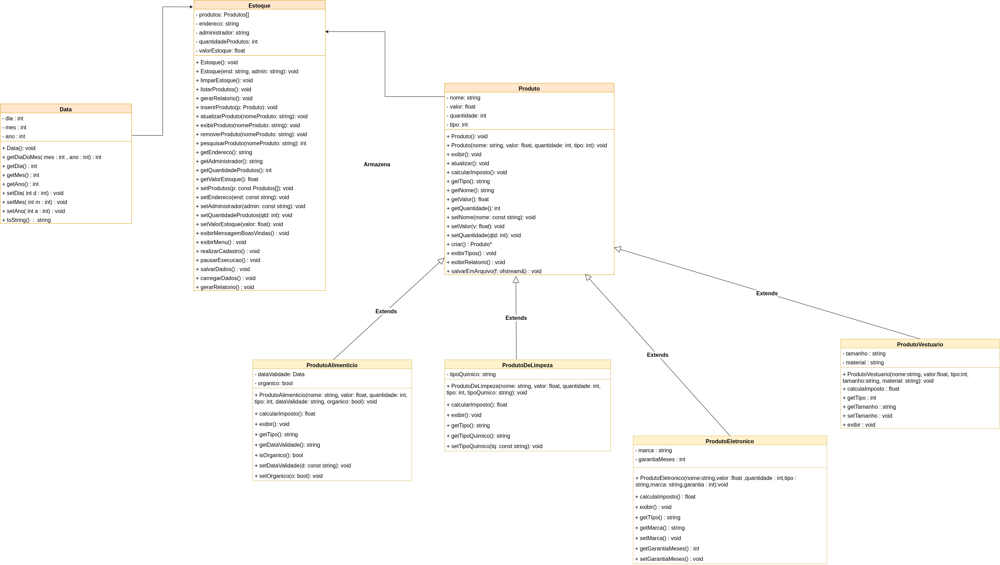

# 📦 Sistema de Gerenciamento de Estoque

Sistema completo de gerenciamento de estoque desenvolvido em C++ utilizando Programação Orientada a Objetos (POO) e implementando operações CRUD (Create, Read, Update, Delete).

## 📋 Sobre o Projeto

Este projeto foi desenvolvido como trabalho da disciplina de Linguagem de Programação I, implementando um sistema robusto para gerenciar produtos de diferentes categorias em um estoque. O sistema utiliza conceitos de POO como herança, polimorfismo e encapsulamento.

## 🎓 Informações Acadêmicas

- **Instituição:** Universidade Federal da Paraíba (UFPB)
- **Curso:** Engenharia da Computação
- **Disciplina:** Linguagem de Programação I
- **Professor:** Derzu Omaia
- **Período:** 2025.2

## 👥 Autores

- [Danilo Beuttenmuller](https://github.com/danilocb21)
- [Eduardo Augusto](https://github.com/Edu92337)

## 🚀 Características Técnicas

- **Linguagem:** C++11 ou superior
- **Paradigma:** Programação Orientada a Objetos (POO)
- **Funcionalidades:** CRUD completo
- **Persistência:** Armazenamento em arquivo de texto
- **Compilação:** Makefile

### Conceitos de POO Aplicados

- **Herança:** Hierarquia de classes de produtos especializados
- **Polimorfismo:** Comportamentos específicos para cada tipo de produto
- **Encapsulamento:** Proteção de dados através de modificadores de acesso
- **Abstração:** Classe base abstrata para produtos

## 📊 Diagrama de Classes



## ⚙️ Funcionalidades

O sistema oferece as seguintes operações:

1. **Criar (Create):** Adicionar novos produtos ao estoque
   - Produtos Alimentícios
   - Produtos Eletrônicos
   - Produtos de Limpeza
   - Produtos de Vestuário

2. **Listar (Read):** Visualizar todos os produtos cadastrados

3. **Buscar (Read):** Pesquisar produto específico por nome

4. **Atualizar (Update):** Modificar informações de produtos existentes

5. **Remover (Delete):** Excluir produtos do estoque

6. **Relatório:** Gerar relatório completo do estoque

7. **Limpar:** Remover todos os produtos do estoque

## 🛠️ Como Compilar e Executar

### Pré-requisitos

- Compilador C++ (g++ recomendado)
- Make

### Compilação

```bash
make
```

### Execução

```bash
./program
```

### Limpeza dos arquivos compilados

```bash
make clean
```

## 📁 Estrutura do Projeto

```
LP1_projeto1/
├── .github/
│   └── Diagrama_classes_lp1.drawio.png
├── include/
│   ├── Data.hpp
│   ├── Estoque.hpp
│   ├── Produto.hpp
│   ├── ProdutoAlimenticio.hpp
│   ├── ProdutoDeLimpeza.hpp
│   ├── ProdutoEletronico.hpp
│   └── ProdutoVestuario.hpp
├── src/
│   ├── Data.cpp
│   ├── Estoque.cpp
│   ├── main.cpp
│   └── Produto.cpp
├── dados.txt
├── makefile
└── README.md
```

### Descrição dos Componentes

- **include/**: Arquivos de cabeçalho (.hpp) com declarações de classes
- **src/**: Implementação das classes e programa principal
- **data/**: Diretório para arquivos de dados
- **dados.txt**: Arquivo de persistência de dados do estoque
- **makefile**: Script de compilação do projeto

## 🔧 Detalhes de Implementação

### Hierarquia de Classes

```
Produto (Classe Base)
├── ProdutoAlimenticio
├── ProdutoEletronico
├── ProdutoDeLimpeza
└── ProdutoVestuario
```

### Classes Principais

- **Produto:** Classe base abstrata com atributos e métodos comuns
- **Estoque:** Gerencia a coleção de produtos e operações CRUD
- **Data:** Classe auxiliar para manipulação de datas
- **Produtos Especializados:** Classes derivadas com atributos específicos

## 💾 Persistência de Dados

O sistema utiliza arquivo de texto (`dados.txt`) para persistência, garantindo que os dados sejam mantidos entre execuções do programa. Os dados são:

- Carregados automaticamente ao iniciar o sistema
- Salvos automaticamente ao encerrar o programa

## 📝 Licença

Este projeto foi desenvolvido para fins acadêmicos.